# Manual del Arquitecto de Software
## Guía Práctica para Arquitectura Ágil de Calidad

> Manual completo para diseñar, documentar y comunicar arquitectura de software de forma ágil y efectiva

---

## 📚 Índice

1. [Fundamentos de Arquitectura](#1-fundamentos-de-arquitectura)
2. [Documentación Ágil: Qué Documentar y Qué No](#2-documentación-ágil)
3. [Diagramas Esenciales](#3-diagramas-esenciales)
4. [Iniciando un Proyecto desde Cero](#4-iniciando-un-proyecto-desde-cero)
5. [Decisiones Arquitectónicas (ADRs)](#5-decisiones-arquitectónicas-adrs)
6. [Patrones Arquitectónicos](#6-patrones-arquitectónicos)
7. [Requisitos No Funcionales](#7-requisitos-no-funcionales)
8. [Checklist del Arquitecto](#8-checklist-del-arquitecto)
9. [Herramientas](#9-herramientas)
10. [Antipatrones y Errores Comunes](#10-antipatrones-y-errores-comunes)
11. [Casos de Estudio](#11-casos-de-estudio)

---

## 1. Fundamentos de Arquitectura

### 1.1 ¿Qué es Arquitectura de Software?

```
Arquitectura de Software =
  Estructura del sistema
  + Decisiones difíciles de cambiar
  + Comunicación entre componentes
  + Principios de diseño
  + Restricciones y trade-offs
```

**NO es:**
- ❌ Diagramas bonitos que nadie lee
- ❌ Documentación de 200 páginas
- ❌ Decisiones tomadas en una torre de marfil
- ❌ Algo que se hace una vez y nunca se revisa

**SÍ es:**
- ✅ Decisiones estructurales que guían el desarrollo
- ✅ Comunicación clara de cómo funciona el sistema
- ✅ Balance entre requisitos técnicos y de negocio
- ✅ Evolución continua con el proyecto

### 1.2 Rol del Arquitecto de Software

**Responsabilidades principales:**

1. **Visionario Técnico**
   - Define la estructura general del sistema
   - Anticipa problemas futuros
   - Balancea calidad vs velocidad vs costo

2. **Tomador de Decisiones**
   - Elige tecnologías y frameworks
   - Define patrones arquitectónicos
   - Documenta decisiones importantes (ADRs)

3. **Comunicador**
   - Traduce requisitos de negocio a soluciones técnicas
   - Explica arquitectura al equipo
   - Alinea stakeholders técnicos y no técnicos

4. **Guardián de la Calidad**
   - Establece estándares de código
   - Define estrategia de testing
   - Asegura mantenibilidad a largo plazo

5. **Mentor del Equipo**
   - Guía decisiones técnicas diarias
   - Transfiere conocimiento
   - Empodera al equipo

**En equipos ágiles:**
```
Arquitecto ≠ Rol separado del equipo
Arquitecto = Desarrollador senior con foco en diseño

Trabaja CON el equipo, NO sobre el equipo
```

### 1.3 Principios Fundamentales

#### Principio 1: YAGNI (You Aren't Gonna Need It)
```
❌ Diseñar para 1 millón de usuarios desde día 1
✅ Diseñar para necesidades actuales + siguiente paso

No sobre-ingenierizar soluciones
```

#### Principio 2: KISS (Keep It Simple, Stupid)
```
La mejor arquitectura es la más simple que resuelve el problema

Simplicidad > Elegancia
Claridad > Inteligencia
```

#### Principio 3: Separation of Concerns
```
Cada componente debe tener UNA responsabilidad clara

Frontend ≠ Backend
Lógica de negocio ≠ Persistencia
Presentación ≠ Datos
```

#### Principio 4: Fail Fast
```
Detectar errores temprano y fallar ruidosamente

Validaciones en el punto de entrada
Excepciones claras y específicas
Logs significativos
```

#### Principio 5: Evolutionary Architecture
```
La arquitectura DEBE evolucionar con el proyecto

Revisar y ajustar cada sprint/mes
Refactorizar cuando sea necesario
Documentar cambios (ADRs)
```

### 1.4 Trade-offs (Siempre Hay)

```
No existe la arquitectura perfecta
Toda decisión tiene pros y contras

Ejemplos:
- Performance vs Simplicidad
- Flexibilidad vs Rigidez
- Escalabilidad vs Complejidad
- Rápido de construir vs Fácil de mantener
- Monolito vs Microservicios
```

**Regla de Oro:**
> Optimiza para el problema que TIENES, no para el que PODRÍAS tener

---

## 2. Documentación Ágil

### 2.1 Manifesto de Documentación Ágil

```
Software funcionando > Documentación exhaustiva

PERO...
La documentación tiene valor cuando:
✓ Ayuda al equipo a entender el sistema
✓ Facilita onboarding de nuevos miembros
✓ Explica decisiones complejas
✓ Sirve como contrato entre equipos
```

### 2.2 Qué SÍ Documentar

#### ✅ 1. Decisiones Arquitectónicas (ADRs)

**Por qué:**
- Las decisiones se olvidan
- El contexto se pierde con el tiempo
- Nuevos miembros preguntan "¿por qué lo hicimos así?"

**Qué incluir:**
```markdown
# ADR-001: Elegir SQLite como Base de Datos

## Estado
Aceptada

## Contexto
- MVP con presupuesto limitado
- Despliegue local en restaurante
- Un solo usuario (el administrador) accediendo a la vez
- No requiere alta concurrencia

## Decisión
Usar SQLite como base de datos

## Consecuencias
+ Simple de configurar (archivo único)
+ Sin servidor de BD separado
+ Cero costo de licencia
+ Suficiente para escala pequeña
- Limitado a ~1000 requests/segundo
- No recomendado para múltiples escritores
- Difícil migrar a otra BD después

## Alternativas Consideradas
- PostgreSQL: Más complejo, requiere servidor
- MySQL: Similar complejidad a PostgreSQL
- MongoDB: Overkill para estructura relacional simple
```

**Cuándo crear ADR:**
- ✅ Elegir base de datos
- ✅ Elegir framework principal
- ✅ Decidir patrón arquitectónico
- ✅ Cambios estructurales importantes
- ❌ Elegir librería de UI menor
- ❌ Decidir nombre de variable

#### ✅ 2. Diagrama de Arquitectura General

**Por qué:**
- Una imagen vale más que 1000 palabras
- Onboarding de nuevos desarrolladores
- Alineación de stakeholders

**Cuándo actualizar:**
- Cuando cambies la estructura general
- Antes de presentar a stakeholders
- Durante onboarding de nuevo miembro

#### ✅ 3. Modelo de Datos

**Por qué:**
- El esquema de BD cambia constantemente
- Es el contrato entre backend y persistencia
- Crítico para entender el dominio

**Forma:**
- Diagrama ER (Entity-Relationship)
- O el schema de BD directamente (DDL)

#### ✅ 4. Flujos Críticos

**Por qué:**
- Procesos complejos no son obvios del código
- Múltiples sistemas interactuando

**Cuándo:**
- Flujo de autenticación
- Proceso de pago
- Integración con sistemas externos

#### ✅ 5. API Contracts (si aplica)

**Por qué:**
- Frontend y Backend necesitan coordinarse
- Otros equipos/sistemas consumen tu API

**Forma:**
- OpenAPI/Swagger (auto-generado del código)
- GraphQL Schema
- Postman collections

#### ✅ 6. README por Módulo

**Por qué:**
- Explica propósito y uso de cada módulo
- Primera parada para nuevos desarrolladores

**Qué incluir:**
```markdown
# Módulo: Orders

## Propósito
Gestión del ciclo de vida completo de pedidos

## Responsabilidades
- Crear pedidos desde el carrito del cliente
- Cambiar estado del pedido (PENDING → IN_PROGRESS → READY → DELIVERED)
- Calcular totales
- Validar disponibilidad de productos

## Estructura
/orders
  /domain
    /model          → Order, OrderItem
    /service        → Lógica de negocio
  /application
    /ports          → Interfaces (use cases)
    /service        → Implementación de use cases
  /infrastructure
    /web            → Controllers REST
    /persistence    → JPA repositories

## Dependencias
- products: Para validar disponibilidad
- tables: Para validar mesa existe

## Endpoints Principales
GET    /api/orders          - Listar pedidos
POST   /api/orders          - Crear pedido
PUT    /api/orders/{id}/status - Cambiar estado

## Testing
npm test:orders
```

### 2.3 Qué NO Documentar

#### ❌ 1. Código Obvio

**Mal:**
```java
/**
 * Este método suma dos números
 * @param a primer número
 * @param b segundo número
 * @return la suma de a y b
 */
public int sum(int a, int b) {
    return a + b; // retorna la suma
}
```

**Bien:**
```java
// No documentes lo obvio, el código habla por sí mismo
public int sum(int a, int b) {
    return a + b;
}

// Solo documenta lo NO obvio:
/**
 * Calcula el total del pedido aplicando:
 * 1. Descuento por cantidad (>5 items: 10% off)
 * 2. Descuento de cupón si existe
 * 3. Impuestos según configuración del restaurante
 */
public Money calculateOrderTotal(Order order) {
    // ...
}
```

#### ❌ 2. Diagramas de Clases Completos

**Por qué:**
- Se desactualizan instantáneamente
- El código ES la fuente de verdad
- Las IDEs generan estos diagramas automáticamente

**Excepción:**
- ✅ Diagrama de clases de dominio principal (high-level)
- ❌ Diagrama de cada clase con todos sus métodos

#### ❌ 3. Documentación de "Cómo Usar" Básico

**Mal:**
```markdown
# Cómo crear un usuario

1. Abrir el archivo UserController.java
2. Ir a la línea 45
3. Encontrar el método createUser
4. Este método recibe un UserDTO
5. UserDTO tiene campos: name, email, password
...
```

**Bien:**
```markdown
# API de Usuarios

POST /api/users
Body: { "name": "John", "email": "john@example.com", "password": "..." }

Ver Swagger: http://localhost:8080/swagger-ui
```

#### ❌ 4. Histórico de Cambios Detallado

**Por qué:**
- Git ya lo tiene
- Nadie lo lee
- Se desactualiza

**Usa:**
- Git commits bien escritos
- Git tags para releases
- CHANGELOG.md automático (desde commits)

#### ❌ 5. Diagramas UML Complejos

**Por qué:**
- Requieren herramientas especiales
- Difícil de mantener
- No aportan valor vs código

**Ejemplos de lo que NO hacer:**
- ❌ Diagramas de secuencia de cada endpoint
- ❌ Diagramas de actividad exhaustivos
- ❌ Diagramas de estados de cada entidad

### 2.4 Reglas de Oro de Documentación

```
Regla 1: Just Enough Documentation
  → Documenta lo mínimo necesario para entender

Regla 2: Living Documentation
  → Si no se actualiza, mejor no existe
  → Auto-genera cuando sea posible (Swagger, DB schema)

Regla 3: Code is Documentation
  → Código limpio > Comentarios extensos
  → Tests bien escritos = documentación ejecutable

Regla 4: Don't Repeat Yourself (DRY)
  → No dupliques info del código en docs
  → Una sola fuente de verdad

Regla 5: Ubicación Importa
  → Docs cerca del código (misma repo)
  → No en wiki separado que nadie actualiza
```

### 2.5 Ubicación de Documentación

```
proyecto/
├── README.md                    → Qué es, cómo empezar, visión general
├── docs/
│   ├── architecture/
│   │   ├── README.md           → Visión arquitectónica general
│   │   ├── diagrams/
│   │   │   ├── system-architecture.mmd
│   │   │   ├── data-model.mmd
│   │   │   └── deployment.mmd
│   │   └── adr/                → Architecture Decision Records
│   │       ├── ADR-001-database-choice.md
│   │       ├── ADR-002-backend-framework.md
│   │       └── template.md
│   ├── api/
│   │   └── openapi.yaml        → Auto-generado
│   └── guides/
│       ├── getting-started.md
│       └── deployment.md
├── backend/
│   └── README.md               → Específico de backend
└── frontend/
    └── README.md               → Específico de frontend
```

---

## 3. Diagramas Esenciales

### 3.1 Filosofía de Diagramas

```
Un buen diagrama:
✓ Se entiende en < 2 minutos
✓ Responde UNA pregunta específica
✓ Usa notación simple y consistente
✓ Se puede actualizar fácilmente (código > herramienta visual)

Un mal diagrama:
✗ Requiere 30 minutos para entender
✗ Intenta mostrar todo a la vez
✗ Usa herramienta propietaria difícil de actualizar
✗ Está desactualizado
```

**Recomendación:**
```
Usa diagrams-as-code (Mermaid, PlantUML, C4-PlantUML)

Ventajas:
+ Versionado en Git
+ Fácil de revisar en PRs
+ Se actualiza con el código
+ No requiere herramientas especiales
```

### 3.2 Modelo C4 (Recomendado)

El **modelo C4** divide la arquitectura en 4 niveles de zoom:

```
C4 Model:
1. Context    → Sistema en su entorno (30,000 ft view)
2. Container  → Aplicaciones y servicios (10,000 ft)
3. Component  → Módulos dentro de cada container (1,000 ft)
4. Code       → Clases (opcional, el código es mejor)
```

#### Nivel 1: Context Diagram (ESENCIAL)

**Propósito:** Mostrar el sistema en su entorno
**Audiencia:** Todos (incluyendo no técnicos)
**Cuándo:** Primera semana del proyecto

**Ejemplo (Sistema QRest):**

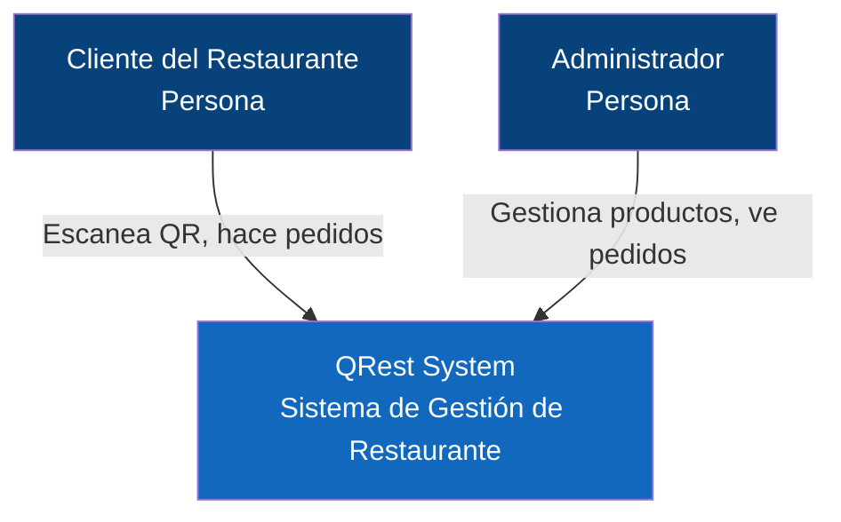

**Código Mermaid:**
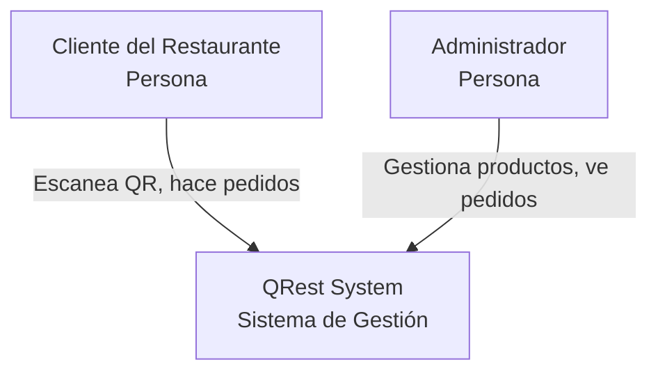

**Qué muestra:**
- Usuarios del sistema (actores)
- El sistema mismo (caja)
- Sistemas externos (si hubiera: pasarelas de pago, servicios de email)
- Relaciones de alto nivel

#### Nivel 2: Container Diagram (ESENCIAL)

**Propósito:** Mostrar las aplicaciones/servicios que componen el sistema
**Audiencia:** Equipo técnico y arquitectos
**Cuándo:** Al definir la arquitectura técnica

**Ejemplo (Sistema QRest):**

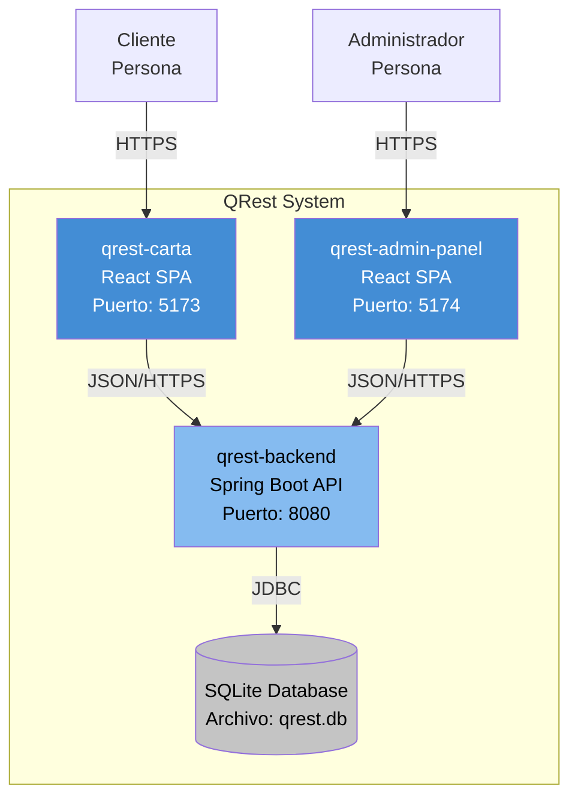

**Código Mermaid:**
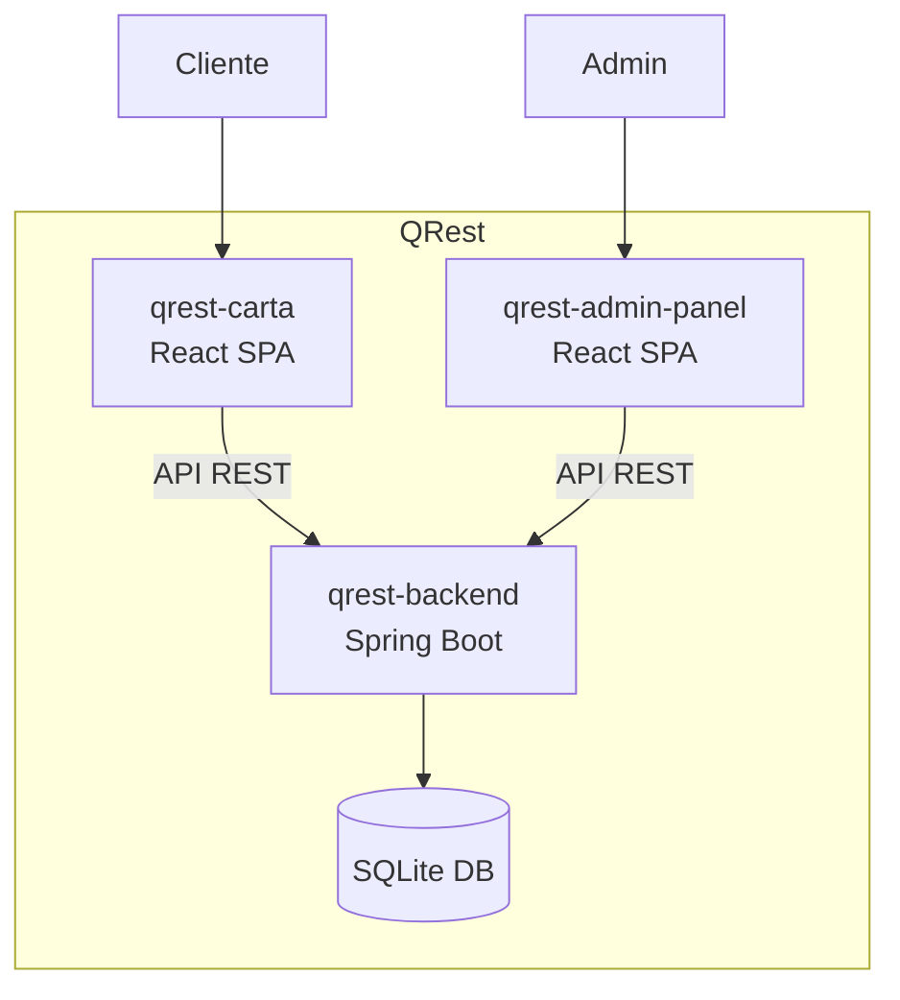

**Qué muestra:**
- Aplicaciones web, móviles, APIs
- Base de datos
- Tecnología de cada componente
- Protocolos de comunicación

#### Nivel 3: Component Diagram (OPCIONAL)

**Propósito:** Mostrar módulos dentro de una aplicación
**Audiencia:** Desarrolladores del componente
**Cuándo:** Solo si el container es muy complejo

**Ejemplo (Backend - Módulos):**

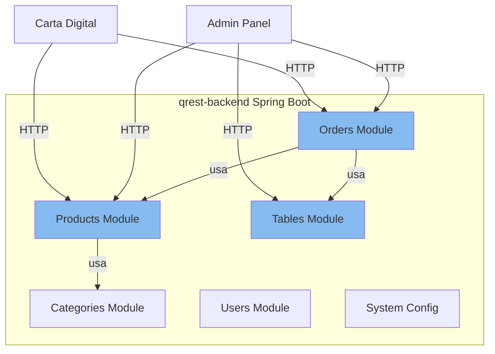

**Código Mermaid:**
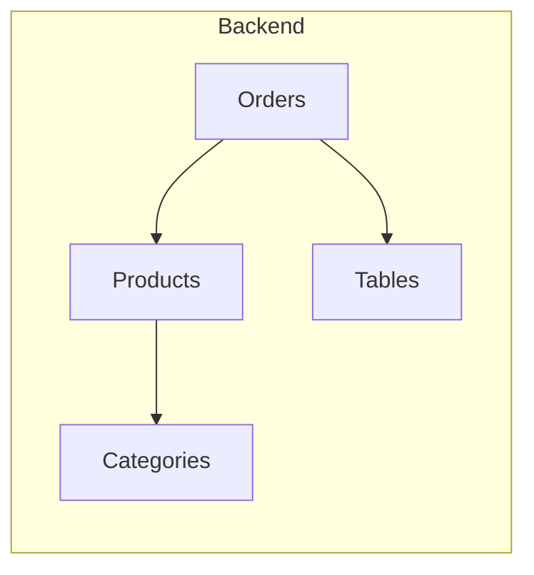

**Qué muestra:**
- Módulos/paquetes principales
- Dependencias entre módulos
- Separación de responsabilidades

### 3.3 Diagrama de Arquitectura de Sistema (ESENCIAL)

**Propósito:** Vista técnica de la arquitectura completa
**Similar a:** C4 Container + detalles técnicos

**Ejemplo completo:**

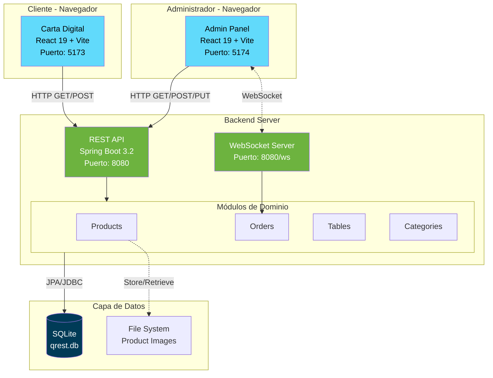

**Elementos clave:**
- Capas de la arquitectura
- Tecnologías principales
- Puertos y protocolos
- Flujo de datos

### 3.4 Modelo de Datos (ESENCIAL)

**Propósito:** Entender el dominio y relaciones entre entidades
**Audiencia:** Todo el equipo técnico
**Cuándo:** Al diseñar el modelo de datos

**Opción 1: Diagrama ER Simplificado**

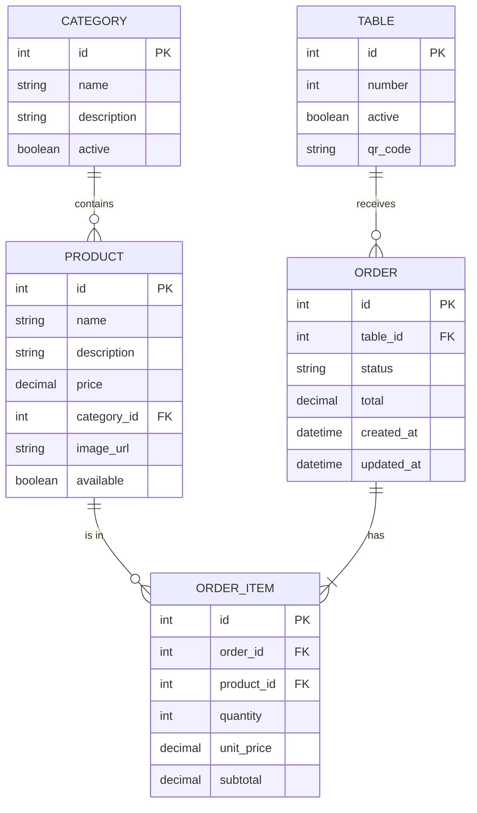

**Opción 2: Notación Crow's Foot (más estándar)**

```
Relaciones:
- CATEGORY (1) ─── (N) PRODUCT
- PRODUCT (1) ─── (N) ORDER_ITEM
- ORDER (1) ─── (N) ORDER_ITEM
- TABLE (1) ─── (N) ORDER

Leyenda:
─── : Relación
(1) : Uno
(N) : Muchos
```

**Herramienta recomendada:**
- dbdiagram.io (online, gratis, genera código)
- Mermaid ER diagram
- DrawSQL

### 3.5 Diagramas de Flujo (SELECTIVOS)

**Solo para flujos críticos o complejos**

#### Ejemplo 1: Flujo de Pedido (Crítico)

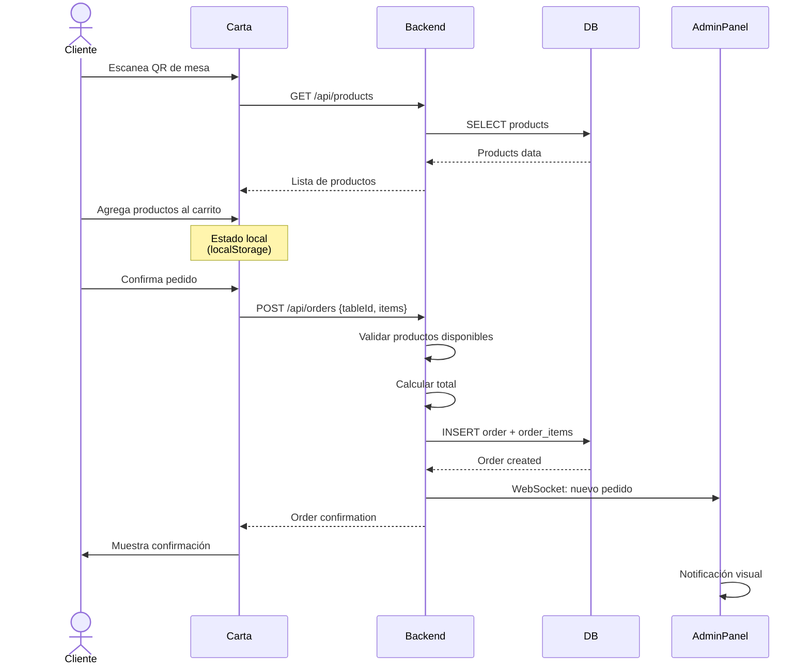

**Código Mermaid:**
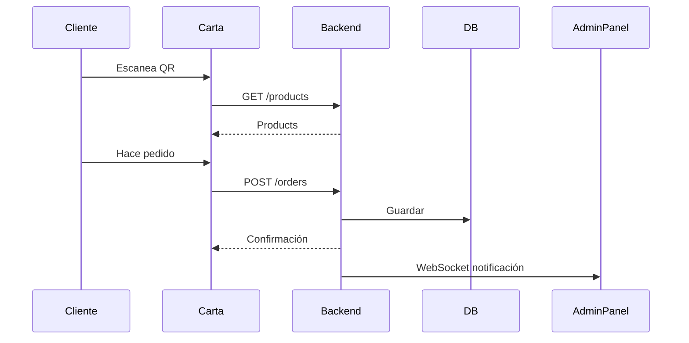

**Cuándo usar:**
- ✅ Flujo de autenticación
- ✅ Proceso de pago
- ✅ Flujos con múltiples sistemas
- ✅ Procesos asíncronos complejos
- ❌ CRUD simple

#### Ejemplo 2: Flujo de Decisión (Algoritmo Complejo)

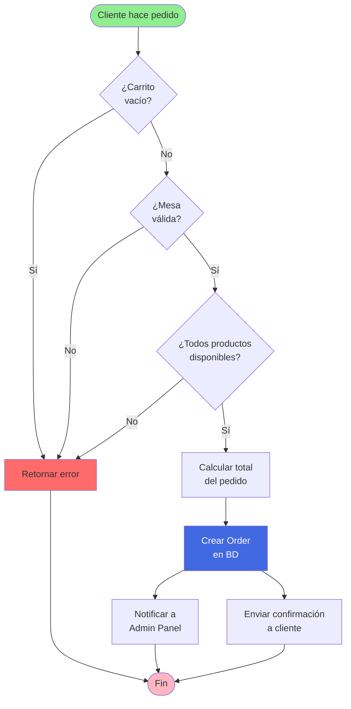

**Cuándo usar:**
- ✅ Lógica de negocio compleja con múltiples condiciones
- ✅ Algoritmos no obvios
- ❌ Lógica simple lineal

### 3.6 Diagrama de Despliegue (OPCIONAL)

**Propósito:** Mostrar infraestructura y deployment
**Cuándo:** Si tienes infraestructura compleja

**Ejemplo Simple (QRest - Deployment Local):**

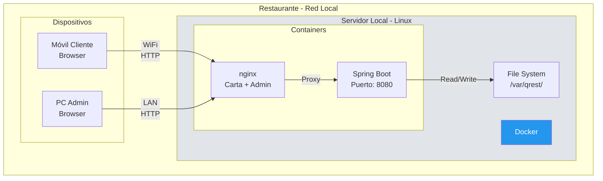

**Ejemplo Complejo (Cloud):**

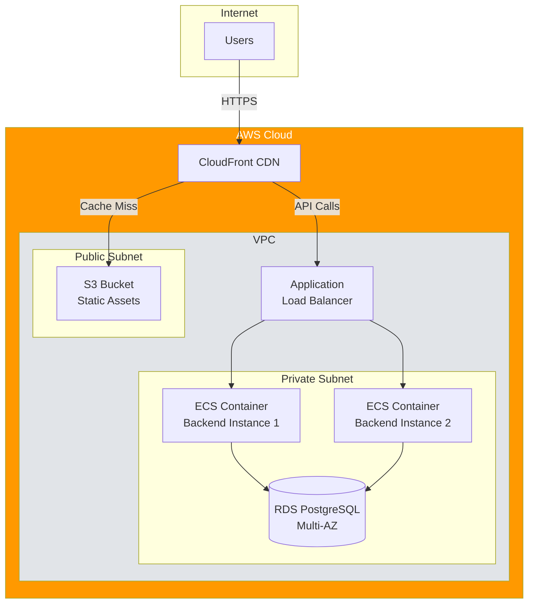

### 3.7 Diagrama de Estados (SOLO SI NECESARIO)

**Cuándo:** Cuando una entidad tiene estados complejos con transiciones estrictas

**Ejemplo: Estados de un Pedido**

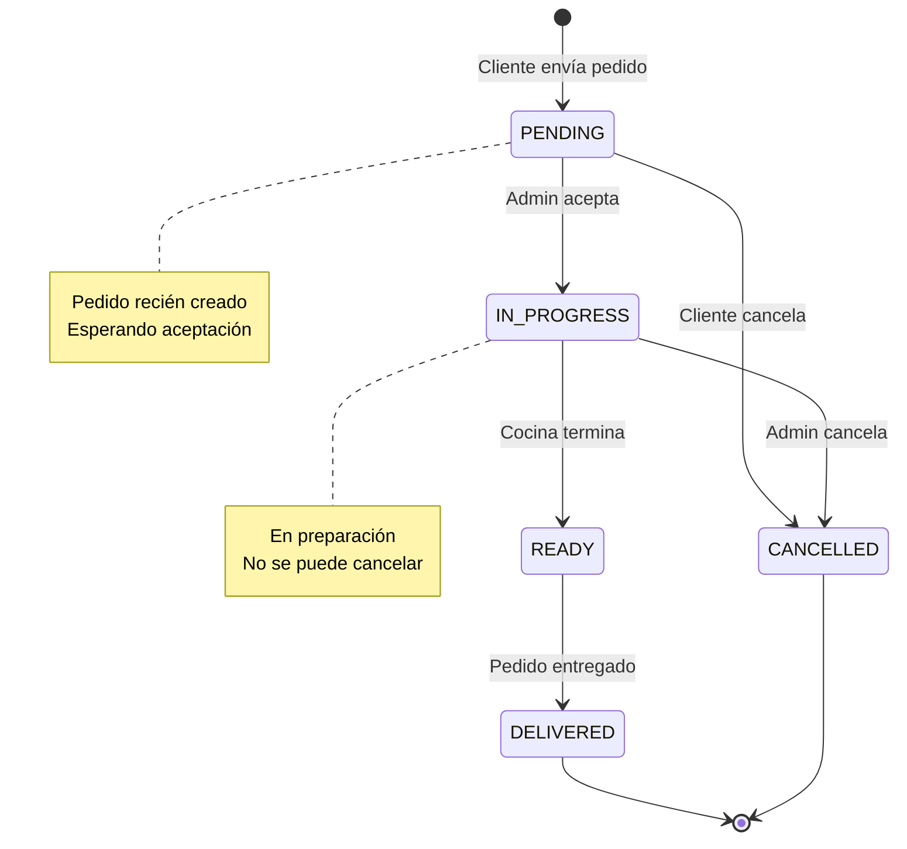

**Código Mermaid:**
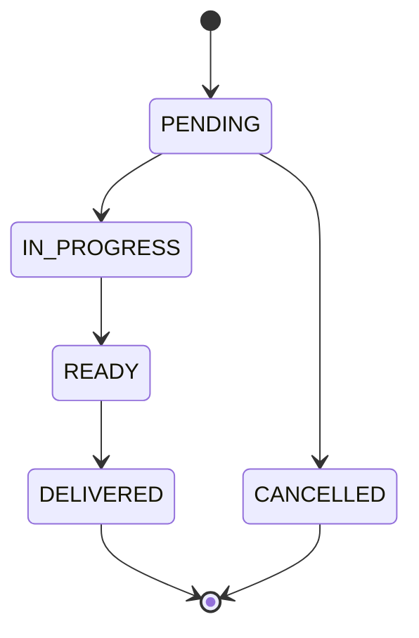

**Alternativa (más simple):**
```
Estados válidos:
PENDING → IN_PROGRESS → READY → DELIVERED
PENDING → CANCELLED
IN_PROGRESS → CANCELLED

Transiciones NO permitidas:
- DELIVERED → cualquier otro
- CANCELLED → cualquier otro
- IN_PROGRESS → PENDING
```

### 3.8 Qué Diagramas NO Hacer

```
❌ Diagrama de clases completo
   → El código ES el diagrama de clases
   → Las IDEs lo generan automáticamente

❌ Diagrama de secuencia de cada endpoint
   → Solo para flujos críticos/complejos
   → El código es más claro

❌ Diagramas UML exhaustivos
   → Difíciles de mantener
   → Requieren herramientas propietarias

❌ Diagramas que duplican el código
   → Si el diagrama es 1:1 con el código, no aporta valor

❌ Diagramas bonitos pero inútiles
   → Si nadie lo consulta, no lo hagas
```

### 3.9 Resumen de Diagramas

| Diagrama | Prioridad | Cuándo | Herramienta |
|----------|-----------|--------|-------------|
| **C4 Context** | 🔴 CRÍTICO | Semana 1 | Mermaid |
| **C4 Container** | 🔴 CRÍTICO | Semana 1-2 | Mermaid |
| **Modelo de Datos** | 🔴 CRÍTICO | Al diseñar BD | Mermaid/dbdiagram |
| **Arquitectura Sistema** | 🟡 IMPORTANTE | Semana 2 | Mermaid |
| **C4 Component** | 🟢 OPCIONAL | Si container complejo | Mermaid |
| **Diagrama Flujo** | 🟢 SELECTIVO | Solo flujos críticos | Mermaid |
| **Diagrama Estados** | 🟢 SELECTIVO | Solo estados complejos | Mermaid |
| **Diagrama Despliegue** | ⚪ NICE-TO-HAVE | Si infra compleja | Mermaid |
| **Diagrama Clases** | ⛔ EVITAR | Nunca (usa código) | - |
| **Secuencia exhaustivos** | ⛔ EVITAR | Nunca | - |

---

## 4. Iniciando un Proyecto desde Cero

### 4.1 Fase 1: Descubrimiento (Semana 1)

#### Checklist de Descubrimiento

```
□ Entender el problema de negocio
  └─ ¿Qué problema resuelve este sistema?
  └─ ¿Quiénes son los usuarios?
  └─ ¿Cuál es el valor principal?

□ Identificar requisitos funcionales
  └─ ¿Qué debe hacer el sistema? (user stories)
  └─ Priorizar (Must-have, Should-have, Nice-to-have)

□ Identificar requisitos no funcionales
  └─ Performance (¿cuántos usuarios? ¿qué latencia?)
  └─ Escalabilidad (¿crece cómo?)
  └─ Seguridad (¿qué proteger?)
  └─ Disponibilidad (¿24/7? ¿downtime aceptable?)
  └─ Mantenibilidad (¿equipo de cuántas personas?)

□ Entender restricciones
  └─ Presupuesto (¿cuánto dinero?)
  └─ Tiempo (¿cuándo debe estar?)
  └─ Equipo (¿cuántos developers?)
  └─ Tecnología (¿hay restricciones tech?)
  └─ Legacy (¿hay que integrar sistemas existentes?)

□ Identificar riesgos
  └─ ¿Qué puede salir mal?
  └─ ¿Dónde está la incertidumbre técnica?
  └─ ¿Qué dependencias externas hay?
```

#### Plantilla de Requerimientos No Funcionales

```markdown
# Requisitos No Funcionales - [Proyecto]

## Performance
- Tiempo de respuesta: < 200ms (p95) para APIs
- Throughput: 100 requests/segundo
- Carga de página: < 2 segundos

## Escalabilidad
- Usuarios concurrentes: 50 inicialmente
- Crecimiento esperado: 10% mensual
- Horizonte: 500 usuarios en 12 meses

## Disponibilidad
- Uptime: 99% (acceptable ~7h downtime/mes)
- Horario crítico: 11:00-15:00 y 19:00-23:00
- Mantenimiento: Domingos 2:00-6:00 AM

## Seguridad
- Autenticación: Requerida para panel admin
- Autorización: Role-based (Admin, Operador)
- Datos sensibles: Passwords hash con BCrypt
- HTTPS: Obligatorio en producción

## Mantenibilidad
- Equipo: 2 developers full-stack
- Skill level: Mid-senior
- Onboarding: < 1 semana para nuevo dev
- Tech stack: Familiar para el equipo

## Observabilidad
- Logs: Nivel INFO en producción
- Monitoring: Básico (uptime, errores)
- Alertas: Email si API down > 5 min

## Costos
- Infraestructura: < $100/mes
- Licencias: Preferir open-source
- Mantenimiento: < 10h/semana

## Restricciones Técnicas
- Deployment: Local en restaurante (no cloud)
- Base de datos: Debe ser embedded (SQLite)
- Networking: Solo red local
- Dispositivos: Browsers modernos (Chrome, Safari)
```

### 4.2 Fase 2: Decisiones Arquitectónicas (Semana 1-2)

#### Decisiones Clave a Tomar

**1. Patrón Arquitectónico**

```
Opciones comunes:

Monolito (Layered Architecture)
  ✓ Simple de desarrollar y desplegar
  ✓ Buen punto de partida
  ✓ Suficiente para < 100k usuarios
  ✗ Acoplamiento entre módulos
  ✗ Difícil escalar partes específicas

Microservicios
  ✓ Escalabilidad independiente
  ✓ Equipos autónomos
  ✗ Complejidad operacional alta
  ✗ Overhead de red
  ✗ Overkill para proyectos pequeños

Modular Monolith (Recomendado para MVP)
  ✓ Simplicidad de monolito
  ✓ Modularidad de microservicios
  ✓ Fácil de evolucionar
  ✓ Deployment simple

Serverless
  ✓ Auto-scaling
  ✓ Pay-per-use
  ✗ Vendor lock-in
  ✗ Cold starts
  ✗ Complejo para desarrollo local
```

**Decisión para QRest:**
```markdown
# ADR-003: Elegir Modular Monolith

## Contexto
- MVP con timeline corto (3 meses)
- Equipo pequeño (2 devs)
- Deployment local (no cloud)
- Requisitos simples de escalabilidad

## Decisión
Usar Modular Monolith con Clean Architecture

Estructura:
- Backend: Spring Boot con módulos de dominio
- Frontend: 2 SPAs separadas (carta, admin)
- BD: SQLite embedded

## Consecuencias
+ Deploy simple (1 JAR + 2 bundles estáticos)
+ Desarrollo rápido
+ Fácil de testear
+ Bajo costo operacional
- Escalabilidad limitada (suficiente para fase 1)
- Si crece mucho, migrar a microservicios será costoso

## Estrategia de Evolución
- Diseñar módulos con bajo acoplamiento
- Usar puertos y adaptadores (hexagonal)
- Facilitar extracción a microservicio futuro
```

**2. Stack Tecnológico**

```
Framework Backend:
□ Spring Boot (Java)      → Enterprise, maduro, mucha comunidad
□ Express (Node.js)       → Simple, JavaScript full-stack
□ Django (Python)         → Baterías incluidas, admin gratis
□ FastAPI (Python)        → Moderno, rápido, async
□ ASP.NET Core (C#)       → Performance, integración Microsoft

Framework Frontend:
□ React                   → Más popular, flexible, gran ecosistema
□ Vue                     → Más simple, curva de aprendizaje suave
□ Angular                 → Todo incluido, opinado
□ Svelte                  → Performance, menos código

Base de Datos:
□ PostgreSQL              → Más completa, open-source
□ MySQL                   → Popular, simple
□ MongoDB                 → NoSQL, flexible schema
□ SQLite                  → Embedded, cero config
□ Firebase/Supabase       → BaaS, rápido de desarrollar
```

**Criterios de selección:**
```
1. ¿El equipo ya la conoce?           (×3.0 peso)
2. ¿Tiene comunidad activa?            (×2.0 peso)
3. ¿Es apropiada para el problema?     (×2.0 peso)
4. ¿Es estable y madura?               (×1.5 peso)
5. ¿Tiene buena documentación?         (×1.5 peso)
6. ¿Es gratuita/open-source?           (×1.0 peso)
7. ¿Es "cool" o trending?              (×0.1 peso)

No elijas tecnología solo porque es nueva o popular
```

**3. Estructura de Directorios**

**Backend (Clean Architecture / Hexagonal):**
```
backend/
├── src/main/java/com/proyecto/
│   ├── products/                   → Módulo de dominio
│   │   ├── domain/
│   │   │   ├── model/             → Entidades de dominio
│   │   │   ├── service/           → Lógica de negocio pura
│   │   │   └── exception/         → Excepciones de dominio
│   │   ├── application/
│   │   │   ├── ports/
│   │   │   │   ├── in/           → Use cases (interfaces)
│   │   │   │   └── out/          → Repository interfaces
│   │   │   └── service/          → Implementación use cases
│   │   └── infrastructure/
│   │       ├── web/
│   │       │   ├── controller/   → REST controllers
│   │       │   └── dto/          → Request/Response DTOs
│   │       ├── persistence/
│   │       │   ├── entity/       → JPA entities
│   │       │   ├── repository/   → Spring Data repos
│   │       │   └── mapper/       → Entity ↔ Domain mapper
│   │       └── config/           → Configuración del módulo
│   │
│   ├── orders/                    → Otro módulo
│   ├── users/
│   └── shared/                    → Código compartido
│       ├── config/               → Configuración global
│       ├── exception/            → Excepciones globales
│       └── util/                 → Utilidades
│
├── src/test/                     → Tests
└── pom.xml / build.gradle        → Dependencias
```

**Frontend (Feature-Sliced Design):**
```
frontend/
├── src/
│   ├── app/                      → Configuración global
│   │   ├── config/
│   │   │   └── apiClient.ts     → Axios config
│   │   ├── router/
│   │   │   └── AppRouter.tsx
│   │   └── store/               → Estado global (si aplica)
│   │
│   ├── features/                → Módulos por feature
│   │   ├── products/
│   │   │   ├── api/
│   │   │   │   └── productService.ts
│   │   │   ├── components/
│   │   │   │   ├── ProductList.tsx
│   │   │   │   ├── ProductForm.tsx
│   │   │   │   └── ProductCard.tsx
│   │   │   ├── hooks/
│   │   │   │   ├── useProducts.ts
│   │   │   │   ├── useCreateProduct.ts
│   │   │   │   └── useUpdateProduct.ts
│   │   │   ├── types/
│   │   │   │   └── product.ts
│   │   │   └── utils/
│   │   │
│   │   ├── orders/
│   │   └── categories/
│   │
│   ├── shared/                  → Componentes reutilizables
│   │   ├── components/
│   │   │   ├── Button/
│   │   │   ├── Input/
│   │   │   ├── Modal/
│   │   │   └── Loading/
│   │   ├── hooks/
│   │   ├── utils/
│   │   └── types/
│   │
│   ├── pages/                   → Páginas/vistas principales
│   │   ├── Dashboard.tsx
│   │   ├── Products.tsx
│   │   ├── Orders.tsx
│   │   └── NotFound.tsx
│   │
│   ├── styles/                  → Estilos globales
│   ├── App.tsx
│   └── main.tsx
│
├── public/
├── package.json
└── vite.config.ts
```

### 4.3 Fase 3: Diseño de Alto Nivel (Semana 2)

#### Crear Diagramas Esenciales

```
1. □ C4 Context Diagram (30 min)
2. □ C4 Container Diagram (1h)
3. □ Modelo de Datos (2-4h)
4. □ Arquitectura de Sistema (1h)
5. □ Flujos críticos (1h por flujo)
```

#### Definir Contratos de API

```markdown
# API Endpoints - V1

## Products
GET    /api/products           - Listar productos
GET    /api/products/{id}      - Obtener producto
POST   /api/products           - Crear producto
PUT    /api/products/{id}      - Actualizar producto
DELETE /api/products/{id}      - Eliminar producto

## Orders
GET    /api/orders             - Listar pedidos
POST   /api/orders             - Crear pedido
PUT    /api/orders/{id}/status - Cambiar estado

## Authentication
POST   /api/auth/login         - Iniciar sesión
POST   /api/auth/logout        - Cerrar sesión
```

**Formato recomendado:** OpenAPI/Swagger
```yaml
openapi: 3.0.0
info:
  title: QRest API
  version: 1.0.0

paths:
  /api/products:
    get:
      summary: List all products
      parameters:
        - name: categoryId
          in: query
          schema:
            type: integer
        - name: available
          in: query
          schema:
            type: boolean
      responses:
        '200':
          description: List of products
          content:
            application/json:
              schema:
                type: array
                items:
                  $ref: '#/components/schemas/Product'

components:
  schemas:
    Product:
      type: object
      properties:
        id:
          type: integer
        name:
          type: string
        price:
          type: number
        categoryId:
          type: integer
        available:
          type: boolean
```

### 4.4 Fase 4: Setup del Proyecto (Semana 2-3)

#### Checklist de Setup

```
Backend:
□ Inicializar proyecto (Spring Initializr, etc.)
□ Configurar estructura de directorios
□ Setup base de datos (migrations)
□ Configurar CORS
□ Configurar logging
□ Setup de testing (JUnit, Mockito)
□ Configurar CI/CD básico
□ README con instrucciones de setup

Frontend:
□ Inicializar proyecto (create-react-app, Vite, etc.)
□ Configurar estructura de directorios
□ Setup de routing
□ Configurar API client (Axios)
□ Setup de testing (Jest, React Testing Library)
□ Configurar linting (ESLint)
□ Configurar formatting (Prettier)
□ README con instrucciones

Documentación:
□ Crear docs/ folder
□ Template de ADR
□ Primer diagrama C4
□ README principal del proyecto

DevOps:
□ Setup de Git (branches, protections)
□ CI pipeline básico
□ Environment variables strategy
□ Docker setup (opcional)
```

### 4.5 Fase 5: Desarrollo Iterativo (Semana 3+)

**Enfoque recomendado:** Feature-driven, vertical slices

```
Iteración 1 (Sprint 1): Feature mínima end-to-end
  → Implementar 1 feature completa (ej: listar productos)
  → Frontend + Backend + BD
  → Deploy y validar

Iteración 2 (Sprint 2): Expandir funcionalidad core
  → Agregar crear/editar productos
  → Testing
  → Refinar arquitectura basado en aprendizajes

Iteración 3+: Features adicionales
  → Seguir agregando features
  → Revisar arquitectura cada 2-3 sprints
  → Actualizar docs cuando cambien decisiones
```

---

## 5. Decisiones Arquitectónicas (ADRs)

### 5.1 ¿Qué es un ADR?

**Architecture Decision Record** = Documento que captura una decisión arquitectónica importante

**Por qué son críticos:**
```
Sin ADRs:
"¿Por qué elegimos SQLite?"
"Ni idea, eso fue hace 6 meses"
"El que lo decidió ya no trabaja aquí"

Con ADRs:
"¿Por qué elegimos SQLite?"
"Revisa ADR-004, ahí está el contexto y las razones"
```

### 5.2 Template de ADR

```markdown
# ADR-XXX: [Título corto de la decisión]

## Estado
[Propuesta | Aceptada | Rechazada | Obsoleta | Reemplazada por ADR-YYY]

## Contexto
¿Cuál es el problema o situación que requiere una decisión?
¿Qué fuerzas están en juego? (requisitos, restricciones, riesgos)

Ejemplo:
- Necesitamos persistir datos de pedidos y productos
- Presupuesto limitado ($0 para infraestructura cloud)
- Deployment local en el restaurante
- Un solo usuario administrador accediendo
- No se requiere alta concurrencia (< 100 req/seg)

## Decisión
¿Qué decidimos hacer?

Ejemplo:
Usar SQLite como base de datos para el MVP

## Consecuencias

### Positivas
- Consecuencia 1
- Consecuencia 2

### Negativas
- Consecuencia 1
- Consecuencia 2

Ejemplo:
### Positivas
+ Cero configuración de servidor de BD
+ Archivo único, fácil de respaldar
+ Gratis y open-source
+ Suficiente para < 1000 pedidos/día
+ Desarrollo local simplificado

### Negativas
- No apto para alta concurrencia (< 1000 writes/seg)
- Difícil migrar a otra BD en el futuro
- No soporta replicación nativa
- Limitado para acceso multi-servidor

## Alternativas Consideradas

### Alternativa 1: PostgreSQL
**Pros:**
- Más robusto y escalable
- Soporta alta concurrencia
- Mejor para futuro crecimiento

**Contras:**
- Requiere servidor separado
- Más complejo de configurar
- Overhead para nuestro caso de uso

**Razón de rechazo:**
Complejidad innecesaria para MVP con tráfico bajo

### Alternativa 2: MySQL
**Pros:**
- Similar a PostgreSQL
- Muy popular

**Contras:**
- Mismos contras que PostgreSQL

**Razón de rechazo:**
Misma razón que PostgreSQL

### Alternativa 3: MongoDB
**Pros:**
- Schema flexible
- Fácil de escalar horizontalmente

**Contras:**
- Nuestros datos son altamente relacionales
- Overhead de servidor
- No apropiado para transacciones complejas

**Razón de rechazo:**
Modelo relacional es más apropiado para nuestro dominio

## Notas
Información adicional, enlaces, etc.

- Documentación SQLite: https://www.sqlite.org/docs.html
- Benchmark: https://...
- Discusión en: GitHub Issue #23

## Metadata
- Fecha: 2025-01-15
- Autores: Juan Pérez, María González
- Revisores: Todo el equipo
- Relacionado con: ADR-001 (Backend Framework)
```

### 5.3 Cuándo Crear un ADR

```
Crea ADR para:
✓ Elegir framework principal (backend, frontend)
✓ Elegir base de datos
✓ Decidir patrón arquitectónico (monolito vs microservicios)
✓ Elegir herramienta de autenticación/autorización
✓ Decidir estrategia de deployment
✓ Cambios arquitectónicos significativos
✓ Trade-offs importantes (performance vs simplicidad)

NO creates ADR para:
✗ Elegir librería de utilidades menor
✗ Decisiones tácticas de implementación
✗ Naming de variables/funciones
✗ Decisiones reversibles fácilmente
```

### 5.4 Workflow de ADRs

```
1. Identificar necesidad de decisión
   ↓
2. Crear ADR en estado "Propuesta"
   ↓
3. Discutir con equipo (PR review, reunión)
   ↓
4. Iterar en el ADR basado en feedback
   ↓
5. Marcar como "Aceptada" cuando haya consenso
   ↓
6. Implementar la decisión
   ↓
7. Si cambia el contexto → Crear nuevo ADR que reemplaza al anterior
```

### 5.5 Organización de ADRs

```
docs/
└── architecture/
    └── adr/
        ├── README.md                      → Índice de todos los ADRs
        ├── template.md                    → Template para copiar
        ├── ADR-001-backend-framework.md
        ├── ADR-002-frontend-framework.md
        ├── ADR-003-arquitectura-backend.md
        ├── ADR-004-base-de-datos.md
        └── ADR-005-autenticacion.md
```

**README.md (Índice):**
```markdown
# Architecture Decision Records

## Active ADRs

| ID | Título | Estado | Fecha |
|----|--------|--------|-------|
| [001](ADR-001-backend-framework.md) | Elegir Spring Boot como backend framework | Aceptada | 2025-01-10 |
| [002](ADR-002-frontend-framework.md) | Elegir React para frontend | Aceptada | 2025-01-10 |
| [003](ADR-003-arquitectura-backend.md) | Usar Clean Architecture | Aceptada | 2025-01-12 |
| [004](ADR-004-base-de-datos.md) | Elegir SQLite para persistencia | Aceptada | 2025-01-15 |

## Obsolete ADRs

| ID | Título | Reemplazada por | Fecha obsoleta |
|----|--------|-----------------|----------------|
| - | - | - | - |
```

---

## 6. Patrones Arquitectónicos

### 6.1 Clean Architecture / Hexagonal Architecture

**Concepto:** Separar el dominio (lógica de negocio) de detalles técnicos (BD, UI, frameworks)

**Capas:**
```
┌─────────────────────────────────────────┐
│         Infrastructure Layer            │ ← Frameworks, BD, UI, APIs externas
│  (Controllers, Repositories, Adapters)  │
├─────────────────────────────────────────┤
│         Application Layer               │ ← Casos de uso, orquestación
│       (Services, Use Cases)             │
├─────────────────────────────────────────┤
│            Domain Layer                 │ ← Lógica de negocio pura
│   (Entities, Value Objects, Services)   │
└─────────────────────────────────────────┘

Dependencias fluyen hacia adentro:
Infrastructure → Application → Domain
Domain NO conoce Infrastructure
```

**Ejemplo práctico:**

```java
// DOMAIN LAYER (núcleo, sin dependencias externas)
package com.qrest.products.domain.model;

public class Product {
    private Long id;
    private String name;
    private Money price;
    private boolean available;

    // Lógica de dominio
    public void markAsUnavailable() {
        if (!available) {
            throw new ProductAlreadyUnavailableException();
        }
        this.available = false;
    }

    public Money calculateDiscountedPrice(Discount discount) {
        return discount.apply(this.price);
    }
}

// APPLICATION LAYER (casos de uso)
package com.qrest.products.application.service;

public class ProductApplicationService implements CreateProductUseCase {

    private final ProductRepository repository;  // Puerto (interface)

    @Override
    public Product createProduct(CreateProductCommand command) {
        // Orquestación
        validateProductDoesNotExist(command.name());

        Product product = new Product(
            command.name(),
            command.price(),
            command.categoryId()
        );

        return repository.save(product);
    }
}

// INFRASTRUCTURE LAYER (adaptadores)
package com.qrest.products.infrastructure.web.controller;

@RestController
@RequestMapping("/api/products")
public class ProductController {

    private final CreateProductUseCase createProductUseCase;

    @PostMapping
    public ResponseEntity<ProductResponse> createProduct(@RequestBody ProductRequest request) {
        CreateProductCommand command = toCommand(request);
        Product product = createProductUseCase.create(command);
        return ResponseEntity.ok(toResponse(product));
    }
}

package com.qrest.products.infrastructure.persistence;

@Repository
public class JpaProductRepository implements ProductRepository {

    private final SpringDataProductRepository springRepo;

    @Override
    public Product save(Product product) {
        ProductEntity entity = mapper.toEntity(product);
        ProductEntity saved = springRepo.save(entity);
        return mapper.toDomain(saved);
    }
}
```

**Beneficios:**
- ✅ Lógica de negocio aislada y testeable
- ✅ Fácil cambiar frameworks (Spring → Quarkus)
- ✅ Fácil cambiar BD (SQLite → PostgreSQL)
- ✅ Testeo sin infraestructura (mocks)

**Cuándo usar:**
- ✅ Proyectos medianos a grandes
- ✅ Lógica de negocio compleja
- ✅ Equipo con experiencia
- ❌ MVPs ultra-rápidos
- ❌ CRUDs muy simples

### 6.2 MVC (Model-View-Controller)

**Concepto:** Separar presentación, lógica y datos

```
┌──────────┐      ┌──────────────┐      ┌───────┐
│   View   │ ←───→│  Controller  │ ←───→│ Model │
│   (UI)   │      │   (Lógica)   │      │ (Datos)│
└──────────┘      └──────────────┘      └───────┘
```

**Cuándo usar:**
- ✅ Aplicaciones web tradicionales (server-side rendering)
- ✅ Frameworks opinados (Rails, Django, Laravel)
- ❌ SPAs (React, Vue, Angular)

### 6.3 Layered Architecture (N-Tier)

**Concepto:** Organizar en capas horizontales

```
┌─────────────────────┐
│  Presentation Layer │ ← UI, Controllers
├─────────────────────┤
│   Business Layer    │ ← Lógica de negocio
├─────────────────────┤
│  Persistence Layer  │ ← Acceso a datos
├─────────────────────┤
│   Database Layer    │ ← BD
└─────────────────────┘
```

**Cuándo usar:**
- ✅ Aplicaciones empresariales tradicionales
- ✅ Equipos grandes con roles especializados
- ❌ Cuando necesitas alta flexibilidad

### 6.4 Event-Driven Architecture

**Concepto:** Comunicación asíncrona vía eventos

```
┌─────────┐   Event   ┌──────────┐   Event   ┌─────────┐
│ Service │ ─────────→│Event Bus │ ─────────→│ Service │
│    A    │           │ (Kafka,  │           │    B    │
└─────────┘           │ RabbitMQ)│           └─────────┘
                      └──────────┘
```

**Cuándo usar:**
- ✅ Microservicios
- ✅ Sistemas con alta concurrencia
- ✅ Necesidad de desacoplamiento temporal
- ❌ Aplicaciones simples
- ❌ Cuando necesitas transacciones fuertes

### 6.5 CQRS (Command Query Responsibility Segregation)

**Concepto:** Separar operaciones de escritura (Commands) de lectura (Queries)

```
Commands (Writes)          Queries (Reads)
    ↓                          ↓
Write Model                Read Model
    ↓                          ↓
Write DB                   Read DB (optimized)
    ↓
  Events
    ↓
  Sync → Read DB
```

**Cuándo usar:**
- ✅ Cuando lectura y escritura tienen requisitos muy diferentes
- ✅ Necesidad de optimizar queries complejas
- ✅ Event sourcing
- ❌ CRUDs simples
- ❌ Equipos pequeños sin experiencia

---

## 7. Requisitos No Funcionales

### 7.1 Categorías

#### 1. Performance

```
Latencia:
- Tiempo de respuesta de API: < 200ms (p95)
- Tiempo de carga de página: < 2s
- Tiempo de búsqueda: < 500ms

Throughput:
- Requests por segundo: 100 rps
- Usuarios concurrentes: 50

Recursos:
- CPU: < 70% en operación normal
- Memoria: < 512MB RAM
- Storage: < 1GB
```

**Cómo medir:**
```bash
# Load testing
artillery quick --count 50 --num 100 https://api.ejemplo.com/products

# Profiling
# Backend: JProfiler, YourKit, async-profiler
# Frontend: Chrome DevTools → Performance tab
```

#### 2. Escalabilidad

```
Vertical (Scale Up):
- ¿Puede manejar más carga agregando recursos al servidor?
- Límite: Capacidad del servidor

Horizontal (Scale Out):
- ¿Puede agregar más instancias?
- Requiere: Load balancer, sesión compartida, BD centralizada

Preguntas clave:
- ¿Cuántos usuarios hoy? ___ usuarios
- ¿Cuántos en 6 meses? ___ usuarios
- ¿Cuántos en 12 meses? ___ usuarios
- ¿Crecimiento: lineal | exponencial | por temporada?
```

**Estrategias:**
```
Nivel 1: Optimizar código
Nivel 2: Caching (Redis, Memcached)
Nivel 3: CDN para assets estáticos
Nivel 4: Réplicas de lectura de BD
Nivel 5: Sharding de BD
Nivel 6: Microservicios con auto-scaling
```

#### 3. Disponibilidad (Availability)

```
Uptime SLA:
- 99%     → ~7h downtime/mes      (aceptable para MVP)
- 99.9%   → ~40min downtime/mes   (producción normal)
- 99.99%  → ~4min downtime/mes    (alta disponibilidad)
- 99.999% → ~26seg downtime/mes   (crítico, muy costoso)

Preguntas:
- ¿Cuál es el horario crítico? (ej: 11am-11pm para restaurante)
- ¿Cuánto cuesta 1 hora de downtime? $ ___
- ¿Hay ventana de mantenimiento? (ej: Domingos 2-6am)
```

**Estrategias:**
```
Nivel 1: Monitoreo + alertas
Nivel 2: Health checks automáticos
Nivel 3: Redundancia (backup server)
Nivel 4: Load balancing con failover
Nivel 5: Multi-región
```

#### 4. Seguridad

```
Autenticación:
- ¿Quién puede acceder?
- ¿Cómo se verifican identidades?

Autorización:
- ¿Qué puede hacer cada usuario?
- RBAC (Role-Based Access Control)
- ABAC (Attribute-Based Access Control)

Protección de datos:
- Datos sensibles: Passwords, PII
- En tránsito: HTTPS/TLS
- En reposo: Encriptación de BD

Cumplimiento:
- GDPR (Europa)
- CCPA (California)
- PCI-DSS (tarjetas de crédito)
```

**Checklist de seguridad:**
```
□ HTTPS en producción
□ Passwords hasheadas (BCrypt, Argon2)
□ Validación de input (XSS, SQL injection)
□ CORS configurado correctamente
□ Rate limiting en APIs
□ Logs de auditoría
□ Secrets en variables de entorno (no en código)
□ Dependencias actualizadas (sin vulnerabilidades)
□ Autenticación de 2 factores (si aplica)
□ Backup de datos
```

#### 5. Mantenibilidad

```
Code Quality:
- Cobertura de tests: > 70%
- Complejidad ciclomática: < 10
- Duplicación de código: < 5%
- Convenciones de código: Enforced (ESLint, Checkstyle)

Documentación:
- README actualizado
- ADRs para decisiones importantes
- API documentada (Swagger/OpenAPI)
- Comentarios en código complejo (no obvio)

Observabilidad:
- Logs estructurados (JSON)
- Métricas (Prometheus, Grafana)
- Tracing distribuido (Jaeger, Zipkin)
- Dashboards de salud del sistema
```

**Tiempo de onboarding objetivo:**
```
Nuevo desarrollador:
- Día 1: Puede correr el proyecto localmente
- Día 2-3: Entiende la arquitectura general
- Semana 1: Puede hacer su primer commit
- Semana 2: Trabaja de forma autónoma
```

#### 6. Usabilidad

```
Experiencia de usuario:
- Diseño responsive (mobile, tablet, desktop)
- Accesibilidad (WCAG 2.1 AA)
- Tiempo de aprendizaje: Usuario promedio aprende en < 5 min
- Tolerancia a errores: Mensajes claros, no "Error 500"

Internacionalización:
- ¿Múltiples idiomas?
- ¿Múltiples monedas?
- ¿Múltiples zonas horarias?
```

### 7.2 Template de NFRs

```markdown
# Requisitos No Funcionales - [Proyecto]

## 1. Performance

| Métrica | Objetivo | Crítico |
|---------|----------|---------|
| Latencia API (p95) | < 200ms | < 500ms |
| Carga de página | < 2s | < 5s |
| Throughput | 100 rps | 50 rps |

## 2. Escalabilidad

- **Usuarios actuales:** 10
- **Usuarios en 6 meses:** 100
- **Usuarios en 12 meses:** 500
- **Estrategia:** Optimización + caching (Nivel 1-2)

## 3. Disponibilidad

- **SLA:** 99% uptime
- **Horario crítico:** 11am-11pm
- **Ventana de mantenimiento:** Domingos 2-6am
- **Monitoreo:** Uptime Robot + alertas por email

## 4. Seguridad

- **Autenticación:** Basic Auth (MVP), JWT (producción)
- **Autorización:** RBAC (Admin, Operador)
- **Datos sensibles:** Passwords (BCrypt), ningún PII
- **Compliance:** No aplica

## 5. Mantenibilidad

- **Cobertura de tests:** > 60% (objetivo 70%)
- **Onboarding:** < 1 semana
- **Documentación:** README + ADRs + API docs
- **Observabilidad:** Logs (INFO level) + monitoreo básico

## 6. Usabilidad

- **Dispositivos:** Smartphones modernos + desktop
- **Browsers:** Chrome, Safari (últimas 2 versiones)
- **Accesibilidad:** No es prioritario para MVP
- **Idiomas:** Español únicamente

## 7. Costos

- **Infraestructura:** $0 (deployment local)
- **Herramientas:** Open-source únicamente
- **Límite mensual:** $50 (SaaS tools opcionales)
```

---

## 8. Checklist del Arquitecto

### 8.1 Antes de Empezar el Proyecto

```
Requisitos:
□ Entendiste el problema de negocio
□ Identificaste usuarios y sus necesidades
□ Priorizaste requisitos funcionales (MoSCoW)
□ Definiste requisitos no funcionales (NFRs)
□ Identificaste restricciones (tiempo, presupuesto, equipo)
□ Identificaste riesgos técnicos principales

Decisiones:
□ Elegiste patrón arquitectónico
□ Elegiste stack tecnológico (con ADRs)
□ Definiste estructura de directorios
□ Definiste estrategia de testing
□ Definiste estrategia de deployment

Documentación:
□ Creaste C4 Context Diagram
□ Creaste C4 Container Diagram
□ Diseñaste modelo de datos
□ Creaste ADRs para decisiones principales
□ Escribiste README principal

Equipo:
□ Alineaste decisiones con el equipo
□ Definiste estándares de código
□ Configuraste herramientas de desarrollo
□ Definiste workflow de Git (branching strategy)
```

### 8.2 Durante el Desarrollo

```
Cada Sprint:
□ Revisar y actualizar diagramas si cambia arquitectura
□ Crear ADR si hay decisión arquitectónica nueva
□ Revisar deuda técnica acumulada
□ Validar que se siguen los estándares

Cada Mes:
□ Retrospectiva de arquitectura
□ Medir métricas de calidad (coverage, duplication)
□ Revisar performance (si hay degradación)
□ Actualizar documentación desactualizada

Code Reviews:
□ Verificar cumplimiento de patrones arquitectónicos
□ Validar separación de responsabilidades
□ Revisar manejo de errores
□ Sugerir mejoras de diseño
```

### 8.3 Al Finalizar el Proyecto

```
Documentación:
□ README completo y actualizado
□ Todos los ADRs reflejan decisiones finales
□ Diagramas actualizados
□ API documentada (Swagger)
□ Guía de deployment

Calidad:
□ Cobertura de tests > objetivo definido
□ Sin deuda técnica crítica
□ Performance cumple NFRs
□ Seguridad validada (sin vulnerabilidades críticas)

Transferencia:
□ Onboarding documentado
□ Sesión de knowledge transfer al equipo de mantenimiento
□ Runbook para operaciones
□ Documentación de troubleshooting común
```

---

## 9. Herramientas

### 9.1 Para Diagramas

**Diagrams as Code (Recomendado):**

| Herramienta | Uso | Pros | Contras |
|-------------|-----|------|---------|
| **Mermaid** | Diagramas en Markdown | + Renderiza en GitHub<br>+ Fácil de aprender<br>+ Versionable | - Menos opciones de customización |
| **PlantUML** | UML completo | + Muy completo<br>+ Versionable | - Sintaxis más compleja<br>- Requiere server para render |
| **Structurizr** | C4 Model | + Diseñado para C4<br>+ Workspace approach | - Requiere cuenta<br>- Herramienta específica |
| **Diagrams (Python)** | Arquitectura cloud | + Programático<br>+ Iconos oficiales | - Solo Python<br>- Curva de aprendizaje |

**Herramientas Visuales:**

| Herramienta | Uso | Pros | Contras |
|-------------|-----|------|---------|
| **draw.io** | Diagramas generales | + Gratis<br>+ Fácil de usar<br>+ Integra con GitHub | - Binario (difícil diff en Git) |
| **Excalidraw** | Sketches rápidos | + Simple<br>+ Colaborativo<br>+ Gratis | - Informal, no profesional |
| **Lucidchart** | Diagramas profesionales | + Muy completo<br>+ Colaborativo | - Pago<br>- Requiere cuenta |
| **Figma** | UI/UX + diagramas | + Excelente para UI<br>+ Colaborativo | - Overkill para solo arquitectura |

**Recomendación:**
```
Diagrams as Code (Mermaid) para:
✓ C4 diagrams
✓ Diagramas de flujo
✓ Diagramas de secuencia
✓ Diagramas de estado
✓ ER diagrams

draw.io para:
✓ Diagramas complejos custom
✓ Cuando Mermaid no es suficiente

Excalidraw para:
✓ Brainstorming rápido
✓ Sketches en reuniones
```

### 9.2 Para Documentación

| Herramienta | Uso | Pros | Contras |
|-------------|-----|------|---------|
| **Markdown en Git** | Documentación general | + Simple<br>+ Versionado<br>+ Cerca del código | - No es wiki |
| **MkDocs** | Docs site estáticas | + Genera sitio bonito<br>+ Markdown<br>+ Themes | - Requiere build |
| **Docusaurus** | Docs site React | + Moderno<br>+ Search<br>+ Versioning | - Más complejo |
| **GitBook** | Wiki colaborativa | + Bonita UI<br>+ Fácil de usar | - Freemium<br>- Externo |
| **Confluence** | Wiki empresarial | + Colaborativo<br>+ Integración Jira | - Pago<br>- Puede quedar obsoleta |

**Recomendación para equipos ágiles:**
```
Markdown en /docs dentro del repo
+ MkDocs si necesitas site público
```

### 9.3 Para ADRs

| Herramienta | Uso |
|-------------|-----|
| **adr-tools** | CLI para crear/gestionar ADRs |
| **log4brains** | ADRs con UI web |
| **Manual (Markdown)** | Simples archivos .md |

**Ejemplo con adr-tools:**
```bash
# Instalar
npm install -g adr-log

# Inicializar
adr init docs/adr

# Crear ADR
adr new "Usar React para el frontend"

# Genera: docs/adr/0001-usar-react-para-el-frontend.md

# Reemplazar ADR
adr new -s 1 "Usar Vue en lugar de React"
# Marca ADR-001 como "Superseded" y crea ADR-002
```

### 9.4 Para API Documentation

| Herramienta | Framework | Generación |
|-------------|-----------|------------|
| **Swagger/OpenAPI** | Agnóstico | Manual o auto |
| **SpringDoc** | Spring Boot | Auto desde annotations |
| **NestJS Swagger** | NestJS | Auto desde decorators |
| **FastAPI** | FastAPI | Auto desde type hints |
| **Postman** | Agnóstico | Manual |

**Recomendación:**
```
Backend con annotations:
  SpringDoc (Spring Boot)
  NestJS Swagger (NestJS)
  FastAPI autodocs (Python)

Backend sin framework opinado:
  OpenAPI spec manual + Swagger UI
```

### 9.5 Para Modelado de Datos

| Herramienta | Tipo | Pros |
|-------------|------|------|
| **dbdiagram.io** | Online | + Gratis<br>+ Código (DBML)<br>+ Export SQL |
| **DrawSQL** | Online | + Bonito<br>+ Colaborativo |
| **MySQL Workbench** | Desktop | + Completo<br>+ Gratis |
| **pgAdmin** | Desktop (PostgreSQL) | + Completo para Postgres |
| **Mermaid ER** | Diagrams as Code | + Versionable |

**Ejemplo dbdiagram.io (DBML):**
```dbml
Table products {
  id int [pk, increment]
  name varchar [not null]
  price decimal(10,2) [not null]
  category_id int [ref: > categories.id]
  available boolean [default: true]
  created_at timestamp [default: `now()`]
}

Table categories {
  id int [pk, increment]
  name varchar [not null]
  description text
}

Table orders {
  id int [pk, increment]
  table_id int [ref: > tables.id]
  status varchar [not null]
  total decimal(10,2)
  created_at timestamp
}

Table order_items {
  id int [pk, increment]
  order_id int [ref: > orders.id]
  product_id int [ref: > products.id]
  quantity int [not null]
  unit_price decimal(10,2)
  subtotal decimal(10,2)
}
```

---

## 10. Antipatrones y Errores Comunes

### 10.1 Antipatrón: Big Ball of Mud

**Síntomas:**
```
- No hay estructura clara
- Todo depende de todo
- No se puede cambiar una parte sin romper otras
- Código espagueti
```

**Cómo evitar:**
```
✓ Definir módulos con responsabilidades claras
✓ Aplicar Separation of Concerns
✓ Revisar arquitectura periódicamente
✓ Refactorizar deuda técnica
```

### 10.2 Antipatrón: Gold Plating

**Síntomas:**
```
- Agregar features "por las dudas"
- Sobre-ingenierizar soluciones
- "Necesitamos soportar 1 millón de usuarios desde día 1"
- Usar tecnologías porque son "cool"
```

**Cómo evitar:**
```
✓ Aplicar YAGNI (You Aren't Gonna Need It)
✓ Construir lo mínimo que resuelve el problema
✓ Iterar basándose en feedback real
✓ Medir antes de optimizar
```

### 10.3 Antipatrón: Architecture by Committee

**Síntomas:**
```
- Decisiones se toman por consenso infinito
- Nadie se responsabiliza
- Parálisis por análisis
- "Necesitamos evaluar 20 frameworks antes de decidir"
```

**Cómo evitar:**
```
✓ Designar arquitecto con poder de decisión
✓ Timeboxear decisiones (ej: 1 semana para elegir framework)
✓ Documentar decisiones (ADRs)
✓ Aceptar que no existe la decisión perfecta
```

### 10.4 Antipatrón: Vendor Lock-in Innecesario

**Síntomas:**
```
- Dependencia total de un proveedor
- Imposible migrar sin reescribir todo
- Costos crecientes sin alternativas
```

**Cómo evitar:**
```
✓ Usar estándares abiertos cuando sea posible
✓ Abstraer servicios de terceros (adapters)
✓ Evaluar costo de migración antes de adoptar
✓ Preferir open-source vs propietario (si tiene sentido)
```

**Ejemplo:**
```java
// ❌ Mal: Lógica de negocio acoplada a AWS
public class OrderService {
    @Autowired
    private AmazonS3 s3Client;  // Vendor-specific

    public void processOrder(Order order) {
        // ... lógica de negocio mezclada con AWS ...
        s3Client.putObject("bucket", "key", data);
    }
}

// ✅ Bien: Abstracción de storage
public class OrderService {
    private final FileStorage storage;  // Interface propia

    public void processOrder(Order order) {
        // ... lógica de negocio ...
        storage.save("key", data);
    }
}

// Implementaciones intercambiables:
public class S3FileStorage implements FileStorage { ... }
public class LocalFileStorage implements FileStorage { ... }
public class AzureBlobStorage implements FileStorage { ... }
```

### 10.5 Antipatrón: Premature Optimization

**Síntomas:**
```
- Optimizar antes de medir
- "Este algoritmo es O(n log n) en lugar de O(n²)"
  (cuando n siempre es < 10)
- Complejidad innecesaria
```

**Regla de oro:**
```
1. Make it work
2. Make it right
3. Make it fast (solo si es necesario)
```

**Cómo evitar:**
```
✓ Medir antes de optimizar (profiling)
✓ Optimizar solo los cuellos de botella reales
✓ Preferir claridad sobre micro-optimizaciones
✓ "Premature optimization is the root of all evil" - Donald Knuth
```

### 10.6 Antipatrón: No Documentation

**Síntomas:**
```
- Cero documentación
- "El código se explica solo"
- Conocimiento en la cabeza de 1 persona
- Onboarding = 1 mes
```

**Cómo evitar:**
```
✓ Documentar decisiones (ADRs)
✓ Mantener README actualizado
✓ Documentar API (Swagger)
✓ Diagramas esenciales (C4 Context + Container)
```

**Balance:**
```
Documentación insuficiente ❌
    ↓
Documentación suficiente ✅
    ↓
Documentación excesiva ❌
```

### 10.7 Antipatrón: Copy-Paste Architecture

**Síntomas:**
```
- "Vi este patrón en otro proyecto, lo copio aquí"
- No entiende por qué se hizo así originalmente
- Contexto diferente, misma solución
```

**Cómo evitar:**
```
✓ Entender el CONTEXTO de la decisión original
✓ Evaluar si aplica a TU problema
✓ Adaptar, no copiar ciegamente
✓ Documentar el razonamiento (ADR)
```

### 10.8 Antipatrón: Resume-Driven Development

**Síntomas:**
```
- Elegir tecnología porque "queda bien en el CV"
- "Usemos Kubernetes" (para 1 servidor)
- "Hagamos microservicios" (en MVP de 2 developers)
- Ignorar contexto del proyecto
```

**Cómo evitar:**
```
✓ Elegir tecnología apropiada al problema
✓ Considerar experiencia del equipo
✓ Evaluar costo de aprendizaje
✓ Priorizar entrega de valor sobre "coolness"
```

### 10.9 Checklist Anti-Antipatrones

```
Al tomar decisión arquitectónica, pregúntate:

□ ¿Estoy resolviendo un problema REAL o hipotético?
□ ¿Esta decisión agrega complejidad innecesaria?
□ ¿El equipo puede mantener esto?
□ ¿Estoy optimizando antes de medir?
□ ¿Hay una solución más simple?
□ ¿Documenté el razonamiento?
□ ¿Esta tecnología es apropiada para el problema?
□ ¿Consideré el costo de migración futuro?
□ ¿Estoy copiando algo sin entender el contexto?
□ ¿Esto agrega valor al negocio?
```

---

## 11. Casos de Estudio

### 11.1 Caso: QRest (Sistema de Restaurante)

#### Contexto

```
Proyecto: QRest - Sistema de gestión de restaurante con carta digital QR
Equipo: 2 developers full-stack
Timeline: 3 meses para MVP
Presupuesto: Muy limitado ($0 para infraestructura)
Usuarios: 1 restaurante, ~50 clientes simultáneos peak
```

#### Decisiones Arquitectónicas

**ADR-001: Modular Monolith con Clean Architecture**
```
Contexto:
- MVP rápido
- Equipo pequeño
- Deployment local

Decisión: Modular Monolith (no microservicios)

Razón:
+ Simplicidad de deployment
+ Suficiente para la escala
+ Fácil refactorizar a microservicios después SI es necesario

Estructura:
backend/qrest/
├── products/     (módulo)
├── orders/       (módulo)
├── tables/       (módulo)
└── shared/       (código compartido)
```

**ADR-002: SQLite como BD**
```
Contexto:
- Presupuesto $0
- Deployment local
- < 100 pedidos/día

Decisión: SQLite

Razón:
+ Cero configuración
+ Archivo único (fácil backup)
+ Suficiente para la escala
- Limitado para alta concurrencia (no es problema aquí)
```

**ADR-003: React para Frontend**
```
Contexto:
- 2 interfaces (carta para clientes, admin panel)
- Necesidad de interactividad
- Equipo conoce React

Decisión: 2 SPAs separadas con React

Razón:
+ Component reusability
+ Gran ecosistema
+ Equipo tiene experiencia
```

#### Diagramas Creados

1. ✅ C4 Context (muestra clientes, admin, sistema)
2. ✅ C4 Container (muestra carta, admin panel, backend, BD)
3. ✅ Modelo de datos (ER con 7 tablas principales)
4. ✅ Arquitectura de sistema (tecnologías + flujo)
5. ✅ Diagrama de flujo de pedido (secuencia crítica)

#### Resultado

```
✓ MVP entregado en 3 meses
✓ Sin deuda técnica crítica
✓ Arquitectura permite evolución
✓ Onboarding de nuevo dev: 3 días
✓ Performance: < 100ms latencia promedio
✓ Costo infraestructura: $0
```

### 11.2 Caso: E-Commerce Mediano

#### Contexto

```
Proyecto: Marketplace de productos artesanales
Equipo: 6 developers + 1 QA
Timeline: 6 meses para lanzamiento
Presupuesto: $200k
Usuarios esperados: 10k en 6 meses, 100k en 12 meses
```

#### Decisiones Arquitectónicas

**Patrón:** Microservicios (justificado)
```
Razón:
- Equipos independientes por dominio
- Necesidad de escalar partes específicas (catálogo vs checkout)
- Diferentes requisitos de performance por servicio
```

**Servicios:**
```
- User Service (autenticación, perfil)
- Product Service (catálogo, búsqueda)
- Order Service (checkout, pagos)
- Notification Service (emails, push)
- Recommendation Service (ML)
```

**Tecnología:**
```
- Backend: Node.js (Product, Order) + Python (Recommendation)
- Frontend: Next.js (SSR para SEO)
- BD: PostgreSQL (transaccional) + Elasticsearch (búsqueda)
- Message Queue: RabbitMQ
- Cache: Redis
- Infraestructura: AWS (ECS, RDS, ElastiCache)
```

#### Diagramas Creados

1. ✅ C4 Context
2. ✅ C4 Container (mostrando 5 microservicios)
3. ✅ C4 Component para Product Service (el más complejo)
4. ✅ Diagrama de deployment en AWS
5. ✅ Diagrama de event flow (async communication)
6. ✅ Modelo de datos por servicio

#### Lecciones Aprendidas

```
✓ Microservicios apropiados para el contexto
✓ Event-driven ayudó con escalabilidad
✗ Subestimaron complejidad operacional (monitoring, debugging)
✗ Overhead de red afectó performance inicialmente
→ Solución: Implementaron API Gateway + caching agresivo
```

---

## 12. Recursos y Referencias

### 12.1 Libros Recomendados

```
Arquitectura:
- "Software Architecture Patterns" - Mark Richards
- "Building Microservices" - Sam Newman
- "Clean Architecture" - Robert C. Martin
- "Fundamentals of Software Architecture" - Richards & Ford

Diseño:
- "Domain-Driven Design" - Eric Evans
- "Design Patterns" - Gang of Four
- "Refactoring" - Martin Fowler

Práctica:
- "The Pragmatic Programmer" - Hunt & Thomas
- "Release It!" - Michael Nygard (producción)
```

### 12.2 Recursos Online

```
Diagramas:
- C4 Model: https://c4model.com
- Mermaid Docs: https://mermaid.js.org
- PlantUML: https://plantuml.com

ADRs:
- ADR GitHub Org: https://adr.github.io
- Template: https://github.com/joelparkerhenderson/architecture-decision-record

Patrones:
- Microsoft Architecture Guide: https://docs.microsoft.com/azure/architecture
- AWS Well-Architected: https://aws.amazon.com/architecture/well-architected
- Martin Fowler's Blog: https://martinfowler.com

Comunidad:
- Software Architecture Reddit: r/softwarearchitecture
- DDD Community: https://www.dddcommunity.org
```

### 12.3 Herramientas Mencionadas

```
Diagramas:
- Mermaid: https://mermaid.live (editor online)
- draw.io: https://app.diagrams.net
- Excalidraw: https://excalidraw.com
- dbdiagram.io: https://dbdiagram.io

Documentación:
- MkDocs: https://www.mkdocs.org
- Docusaurus: https://docusaurus.io
- adr-tools: https://github.com/npryce/adr-tools

API:
- Swagger Editor: https://editor.swagger.io
- Postman: https://www.postman.com
```

---

## Resumen Ejecutivo

### Los 10 Mandamientos del Arquitecto Ágil

1. **Documenta lo justo y necesario**
   - ADRs para decisiones importantes
   - Diagramas esenciales (C4 Context + Container + Modelo de datos)
   - README actualizado
   - El resto lo genera el código

2. **Usa diagramas as code**
   - Mermaid en archivos .md
   - Versionado en Git
   - Fácil de actualizar

3. **YAGNI: Construye lo que necesitas HOY**
   - No diseñes para 1 millón de usuarios si tienes 10
   - Evoluciona la arquitectura incrementalmente

4. **Simplicidad > Elegancia**
   - La mejor arquitectura es la más simple que resuelve el problema
   - Evita sobre-ingeniería

5. **Documenta decisiones, no código obvio**
   - Crea ADR para cada decisión arquitectónica importante
   - No documentes lo que el código ya dice claramente

6. **El código ES documentación**
   - Código limpio y bien estructurado
   - Tests como documentación ejecutable
   - APIs auto-documentadas (Swagger)

7. **Mide antes de optimizar**
   - No optimices prematuramente
   - Profiling → identificar bottleneck → optimizar
   - Performance es un requisito, no una "mejora"

8. **Diseña para mantenibilidad**
   - El código se lee 10x más que se escribe
   - Onboarding < 1 semana
   - Módulos desacoplados

9. **Acepta que habrá cambios**
   - Arquitectura evolutiva
   - Refactoriza regularmente
   - Documenta cambios (nuevos ADRs)

10. **Comunica, comunica, comunica**
    - Diagramas para todos los stakeholders
    - ADRs para el equipo
    - API docs para developers
    - README para todos

---

**Última actualización:** Diciembre 2025
**Versión:** 1.0
**Autor:** Manual de Arquitectura de Software
**Licencia:** Uso libre para aprendizaje y aplicación profesional

---

**¿Preguntas? Revisa:**
- [MANUAL_ESTIMACION_SOFTWARE.md](MANUAL_ESTIMACION_SOFTWARE.md) - Para estimar proyectos
- [CHEATSHEET_ESTIMACION.md](CHEATSHEET_ESTIMACION.md) - Referencia rápida
- Este manual - Para diseñar arquitectura
